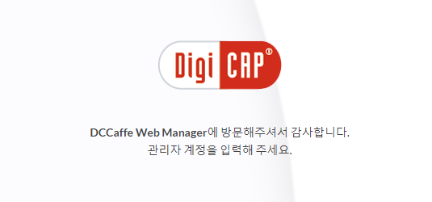
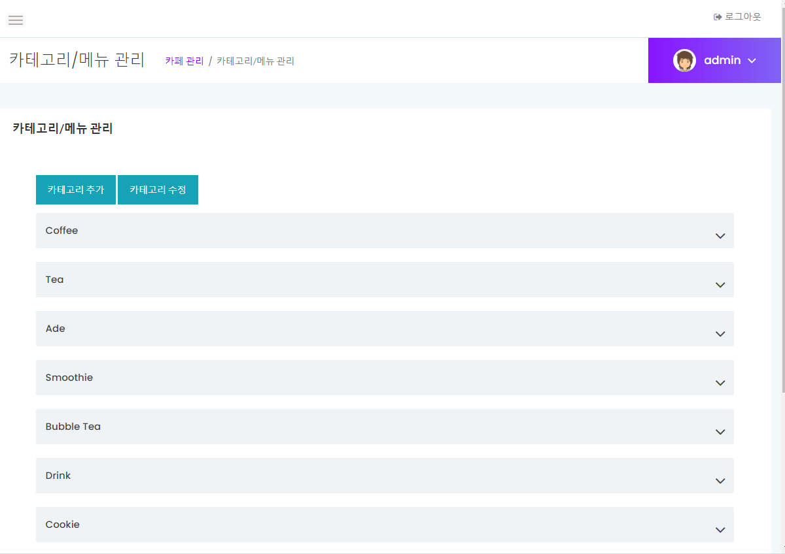

# DCWebManager

DigiCAP Web Manager Renewal

## TODO
- [X] 기존 프로젝트(spring) 기반으로 go 프로젝트 생성
- [ ] UI 재 개발(JSP -> HTML + template)
  - [X]  login
  - [ ]  index
  - [ ]  user_list
  - [ ]  user_bill
- [ ] DB 연결
- [ ] User 서버, Api 서버 연동 

## Build
### go-bindata 설치
```
go get -u github.com/jteeuwen/go-bindata/...
```
### resource build
```
go-bindata static/... templates/...
go fmt bindata.go
```
### single binary build
```
go build
```

## 로그인


## 카페 메뉴 관리

